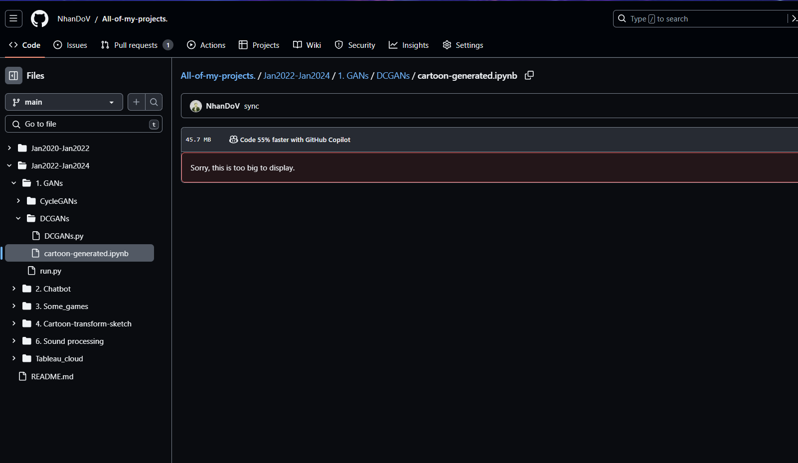
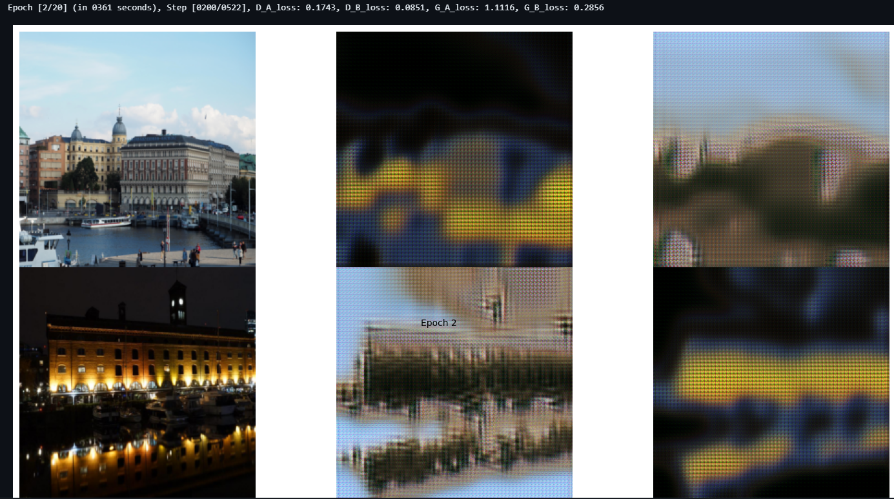
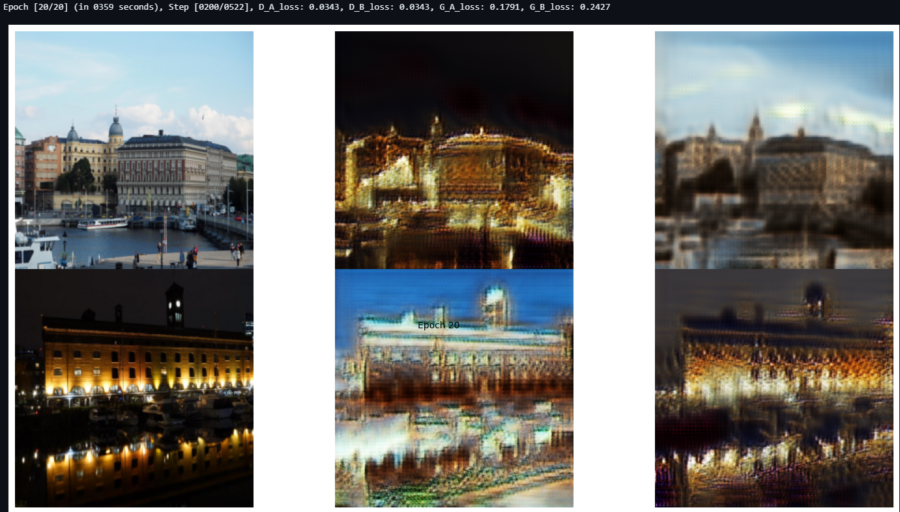
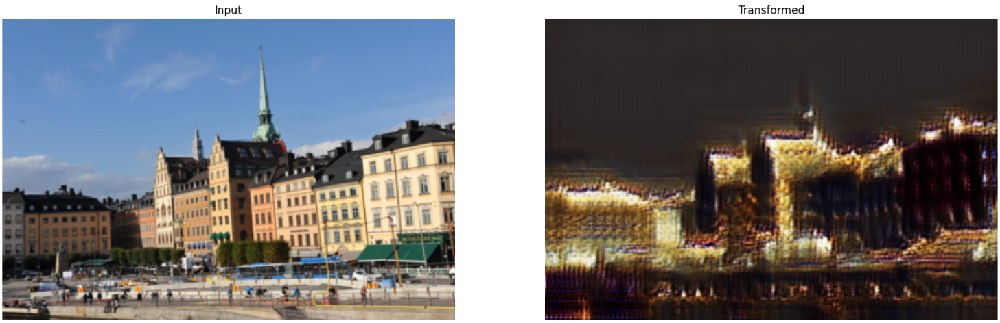
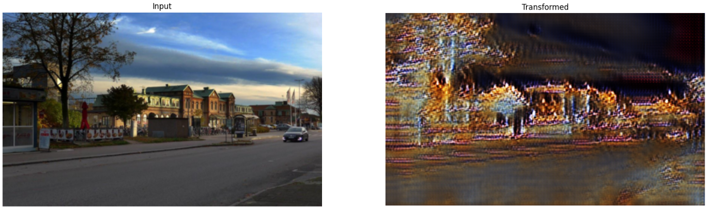
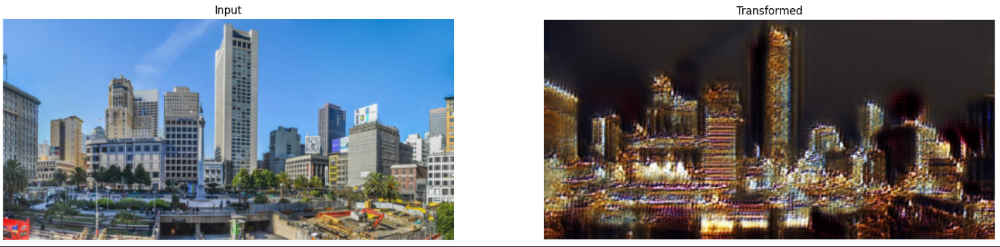

Sometime if you can not see the [notebook.results](https://github.com/NhanDoV/All-of-my-projects./blob/main/Jan2022-Jan2024/1.%20GANs/CycleGANs/cyclegans.ipynb) 

But you can download this notebook if you want to see all of the processing-flow

And here is the result for each epoch in the training process

Finally, after finishing model, here is the transformed-output

