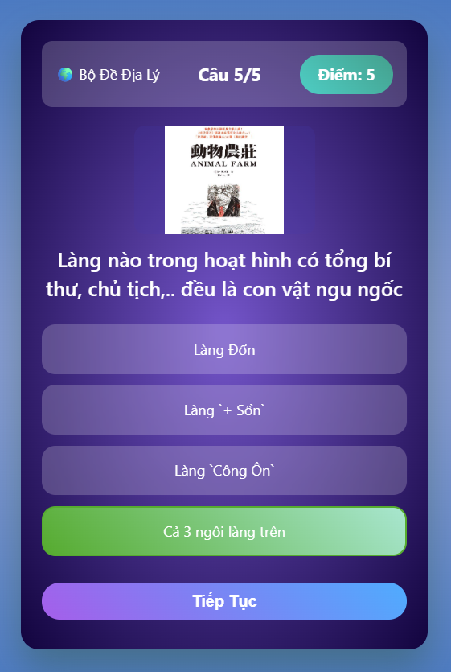

# 🎮 Troll Quiz Game

A mini quiz game written in **half Vietnamese – half English**, focused on fun, memes, and light trolling 😆  
Built using **pure HTML, CSS, and JavaScript** — no frameworks involved.

---

## 🧠 Overview

Troll Quiz Game lets players choose from multiple **quiz sets**, each with its own questions and a bit of trolling energy 🤡  
The only goal: **answer questions, get scores, and have fun** — accuracy is optional.

---

## 📚 Available Quiz Sets

Players can choose one of the following quiz topics:

- 🦁 **Animals Quiz**  
  > Questions about the animal world.

- 🌍 **Geography Quiz**  
  > Countries, territories, and geography-related knowledge — sometimes slightly controversial, mostly for fun 😏

- 🍎 **Food Quiz**  
  > Dishes, origins, and general food knowledge from around the world.

- 🔬 **Science Quiz**
  > Hacked science questions

- 🎵 **Music Quiz**  
  > Artists, instruments, and popular music knowledge.

---

## 🎯 How to Play

1. Choose a **quiz set** from the main menu
2. Answer questions one by one
3. Each question can only be answered **once**
4. After selecting an answer:
   - The correct answer is highlighted
   - A **Next** button appears
5. At the end of the quiz, the game shows:
   - Your score
   - Percentage result
   - A feedback message (sometimes troll 😆)

---

## 🛠️ Tech Stack

- HTML5  
- CSS3 (Flexbox, Gradients, Responsive layout)  
- JavaScript (DOM manipulation)

👉 No external libraries, easy to read, easy to modify, easy to extend.

---

## 📸 Preview

