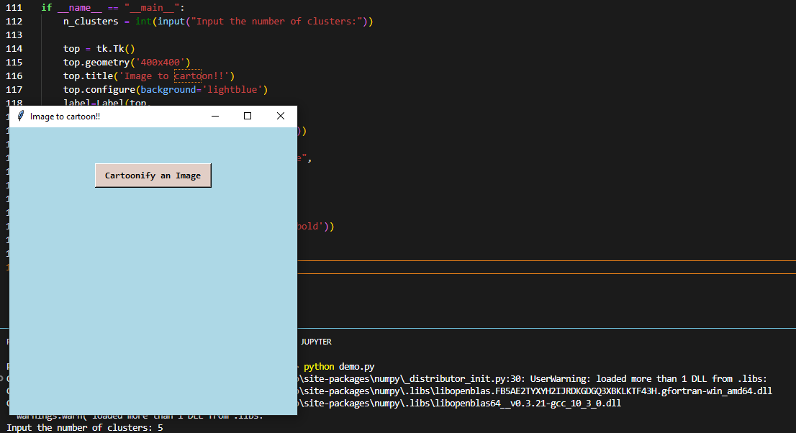
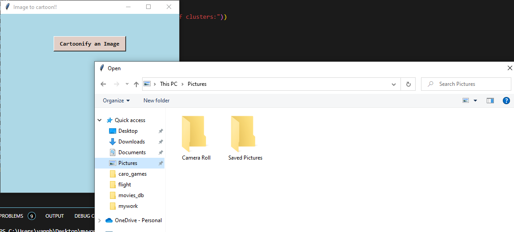
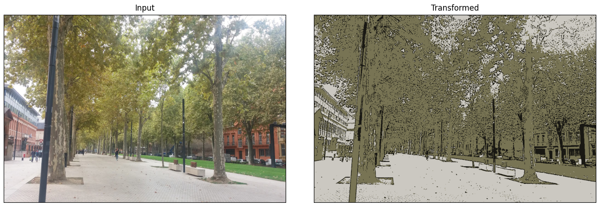
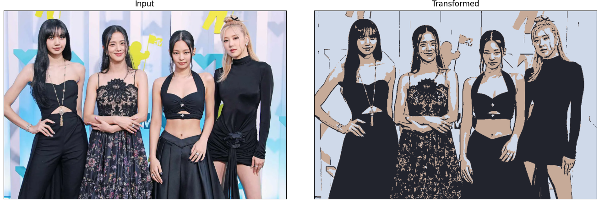
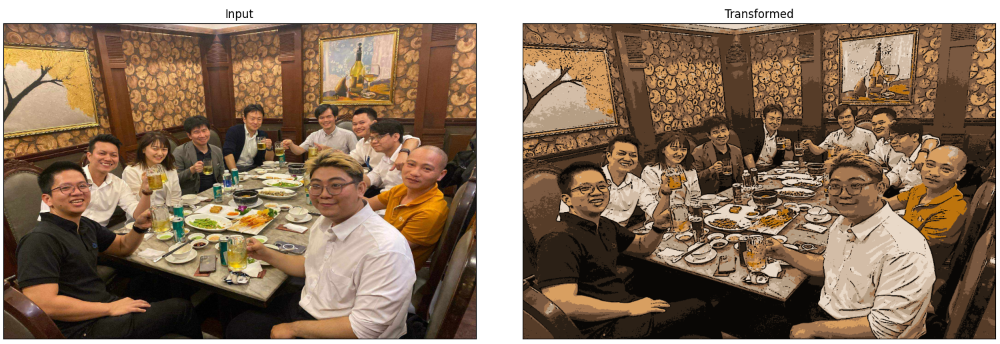

The main idea of this algorithms is using step-by-step as follow

        1. Convert input image to gray-scale
        2. Smoothing image using `medianBlur` and `ADAPTIVE_THRESH_MEAN_C`
        3. Apply bilateral filter to remove noise & keep edge sharp as required
        4. Apply KMeans clustering in the final-result

- Step 1. Launch the program `python demo.py`

- Step 2. Input the number of clusters

- Step 3. Upload image, and we have these following illustrations

