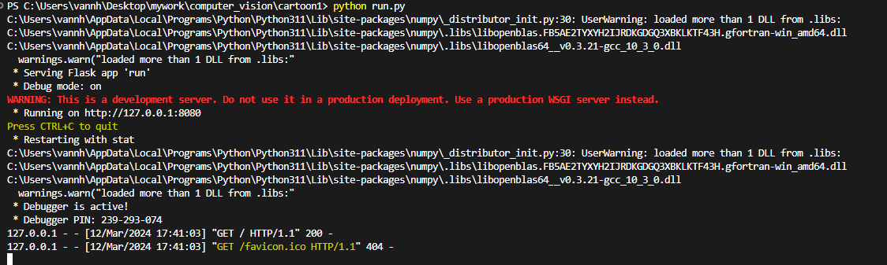
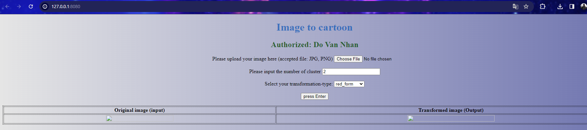
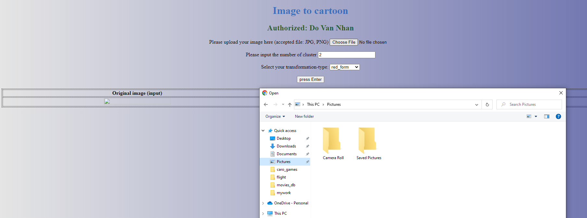
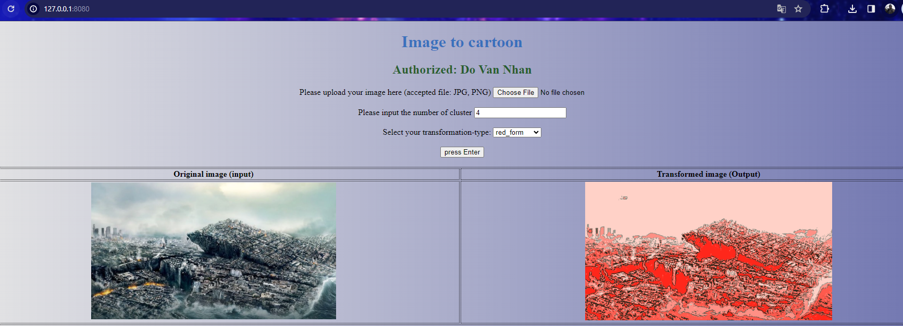
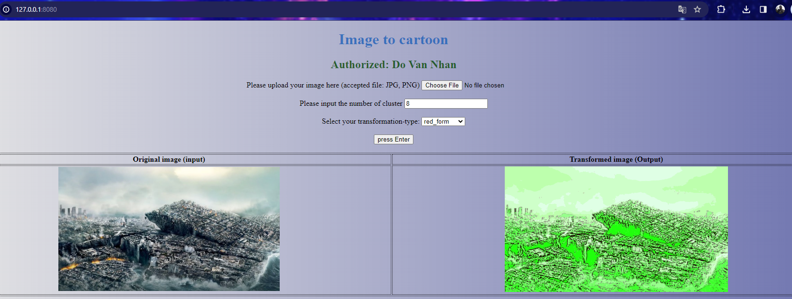
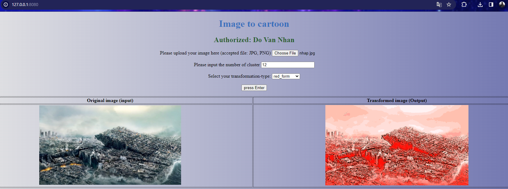

Please make sure that you are in the right `current directory` before running `python run.py`

- Step 1

- Step 2

- Step 3

- Step 4. 

if increasing the number of clusters to 8

if increasing the number of clusters to 12
