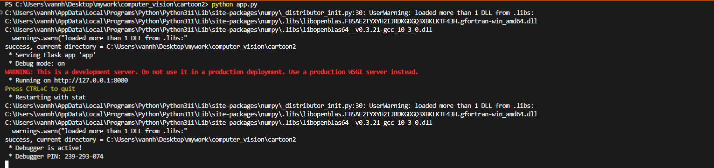
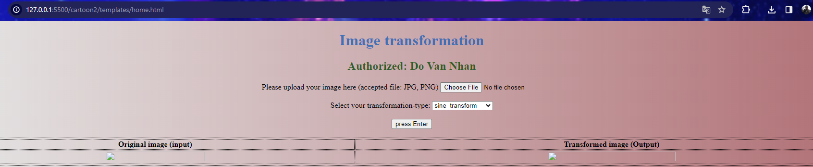
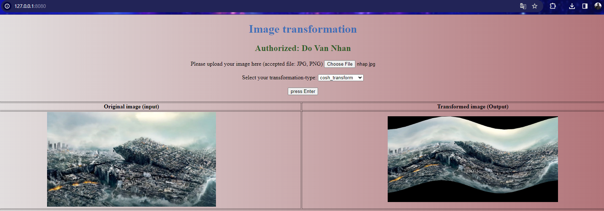
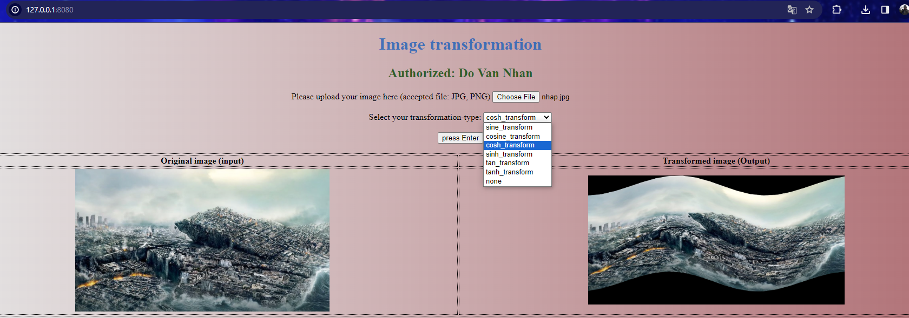

Please make sure that you are in the right `current directory` before running `python run.py`

- Step 1

- Step 2

- Step 3, what if `cosine function`

You will also can select the other transformation

For example, `tan function`
if increasing the number of clusters to 8
