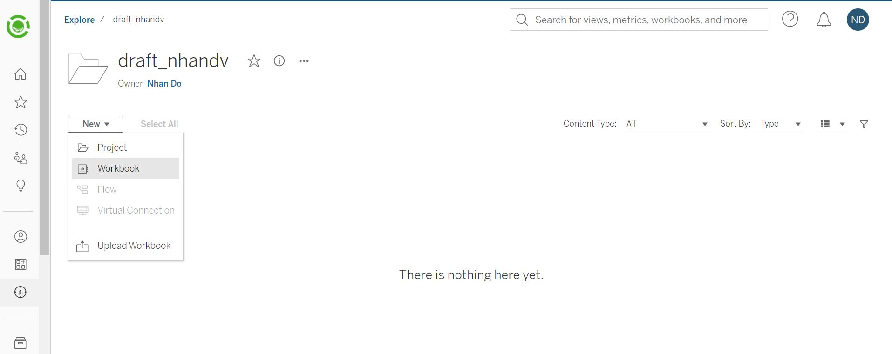
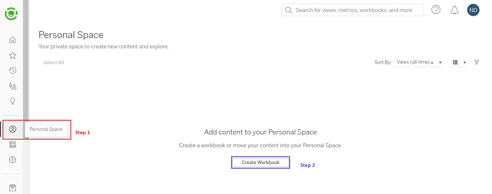
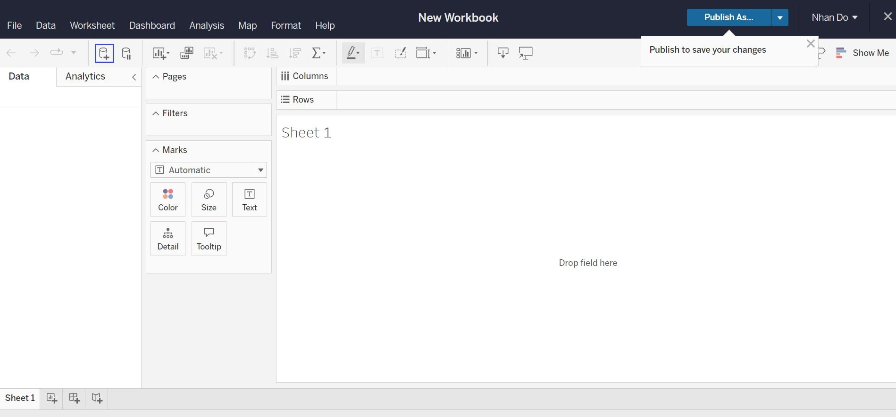
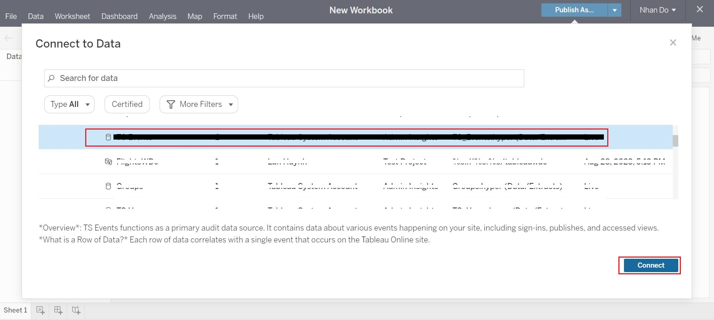
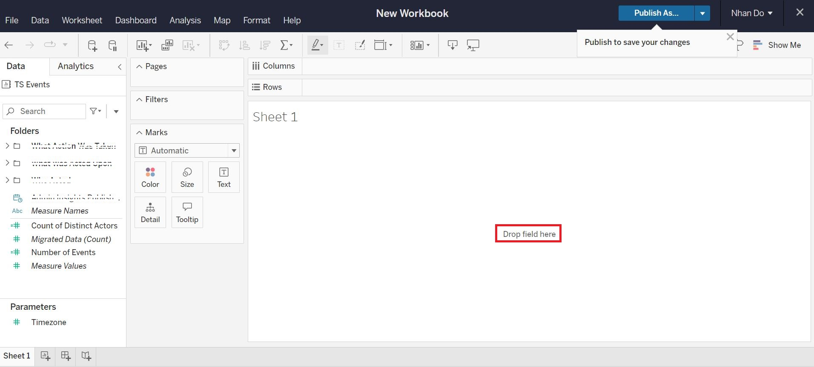
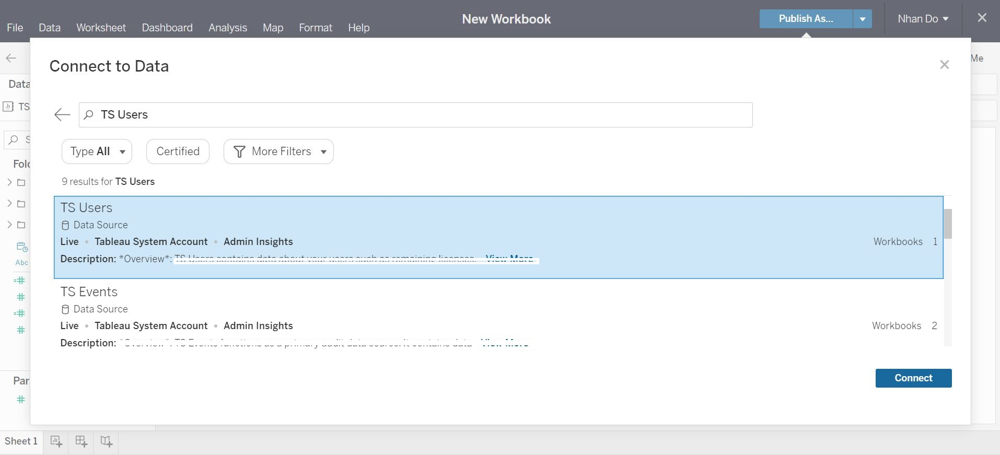
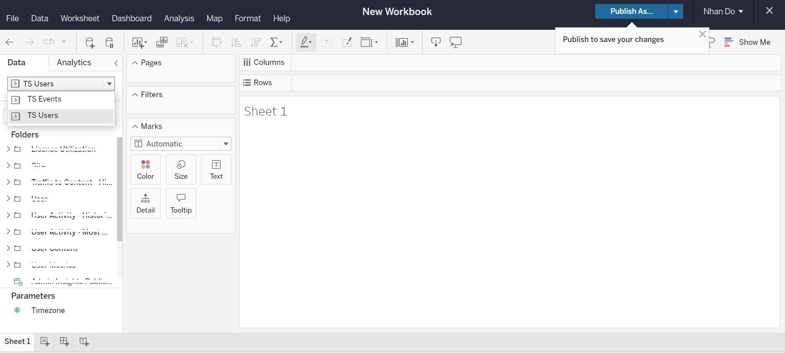
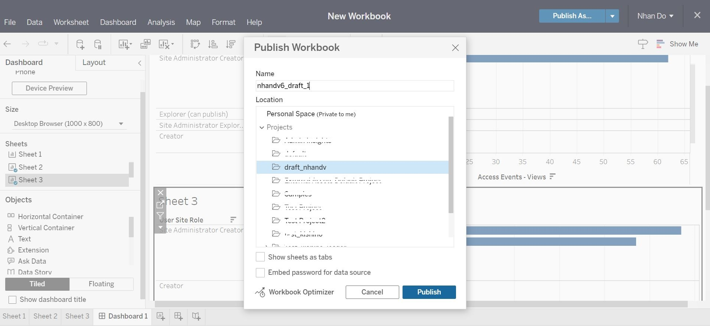
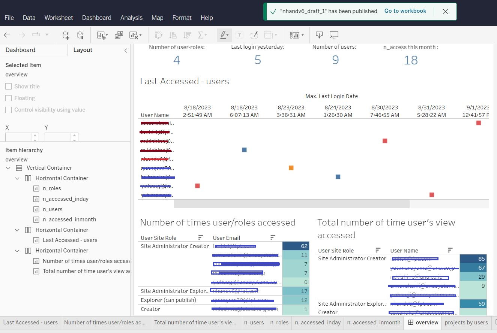

You can directly create a new workbook inside the project that you created before [Reference]()

Or from the Homepage, click on "Personal space"

Then, 

Now, select a data-source then press "Connect"

you will obtain

In case you want to add the other data-source, do the samething as you have done before,

Now, 

