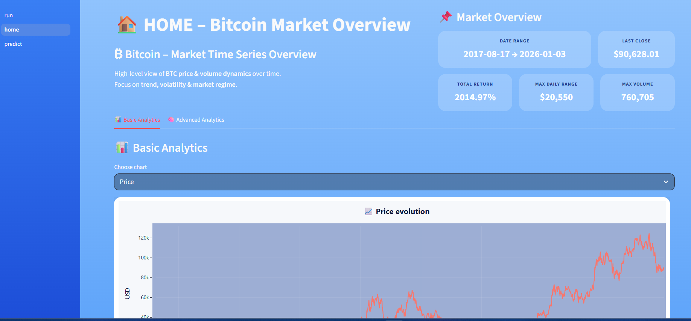
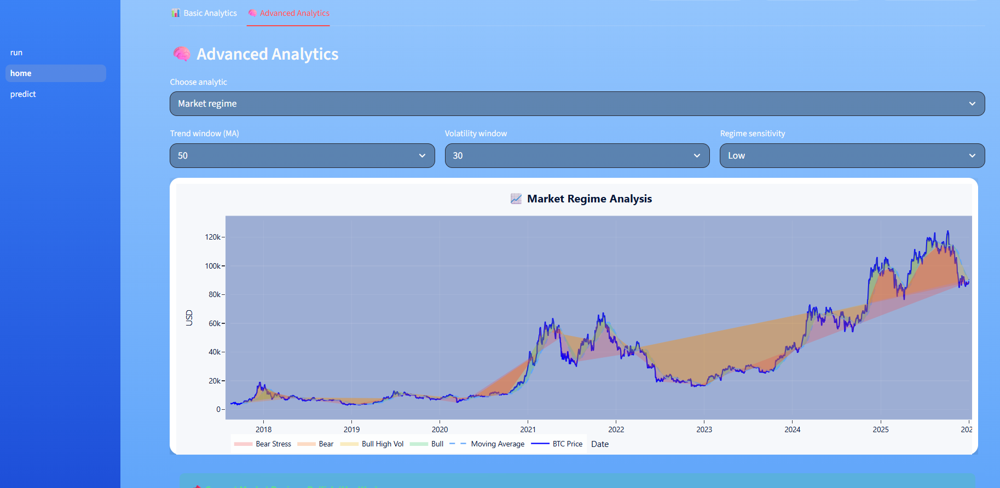
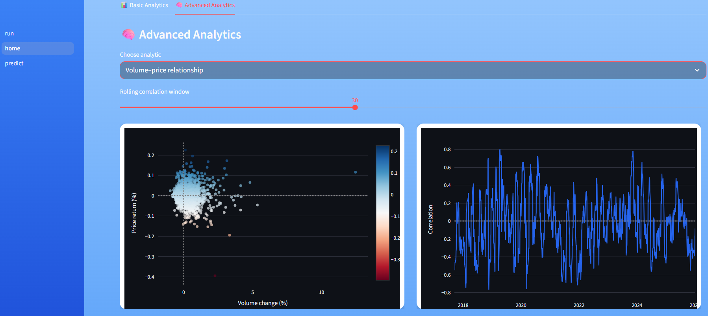
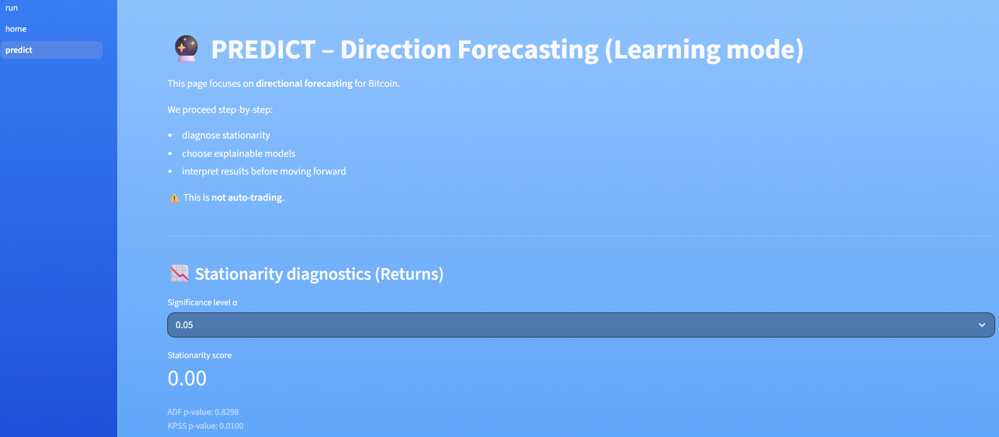
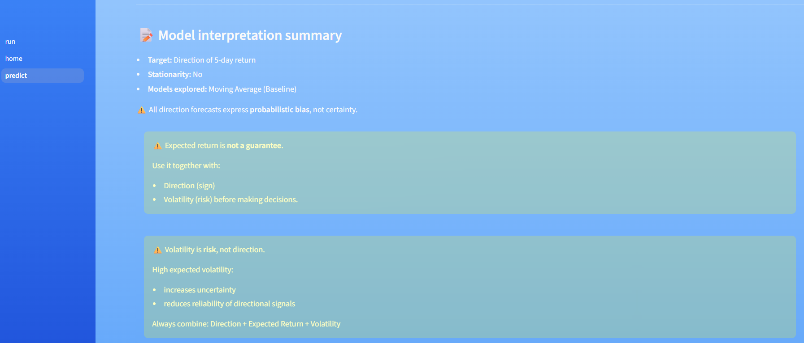

## Step 1. Crawl data
Open your terminal, in the first time

```python
python ingest.py
```

to get whole dataset

## Step 2. Update data

```python
python update.py
```

## Step 3. Analytic







## Step 4. Predict



