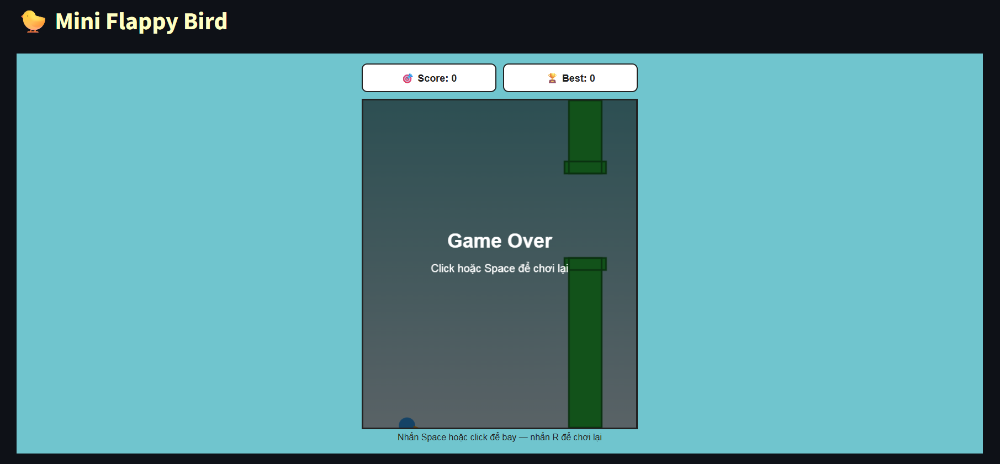

Viết game bằng [JS](https://github.com/NhanDoV/All-of-my-projects./tree/main/Jan_2022-Dec_2023/3.%20Some_games/mini-js-games) hay [pygame/turtle](https://github.com/NhanDoV/All-of-my-projects./tree/main/Jan_2022-Dec_2023/3.%20Some_games/Snake) đã được discuss trước đó, nay tôi sẽ thử (với sự hỗ trợ từ LLMs) để tạo vài con game trên Streamlit

## Installation
```python
pip install streamlit
```

## Some results
`Tower of Hanoi`


`Stone Games`
- **SG 1**


`Funny Quiz`


`N_Queens_Puzzle`


`Flappy Bird`


`Guessing Number`
